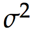
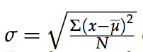
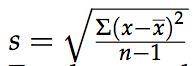

# Collaborative Statistics

## Table of contents:
1. [Chapter 1: Sampling and Data](#Chapter1)
2. [Chapter 2: Descriptive Statistics](#Chapter2)
3. [Chapter 3: Probability Topics](#Chapter3)
4. [Chapter 4: Discrete Random Variables](#Chapter4)

## Chapter 1: Sampling and Data
Organizing and summarizing data is called descriptive statistics. Data can be classified in 4 different levels:

* Nominal scale level: Qualitative data like colors and gender falls in this category.
* Ordinal scale level: Similar to Nominal data, but this type can be orderer. i.e. top 5 parks in a country, opinions ranging bad, average and good.
* Interval scale level: Data that can be measured but does not have a starting point. i.e. temperature has a 0 Celsius, but -10 is cooler, but 80 C is not 4 times hotter than 20 C.
* Ratio scale level: Similar to the interval scale, but the differences in the scale makes sense and there is a 0 point. i.e. a test result.

Probability is a mathematical tool used to study randomness. Key terms:

* Population: Entire collection of elements of study.
* Sample: fraction of the population.
* Statistic: a number that is a property of the sample, it is an estimate of a population parameter. (i.e. average score of the students of a class)
* Parameter: a statistic of the population.
* Variable: notated by capital letters like X and Y, is a characteristic of interest for each person or thing in a population. Can be numerical or categorical.
* Data: Actual values of the variable.
* Frequency: the number of times a given datum occurs in a data set
* Relative frequency: Proportion of the count in the total.
* Cumulative relative frequency: the accumulation of the previous relative frequencies.

The data can be as well quantitative and qualitative, the first can be count or measured, quantitative data can be discrete (counting numbers) or continuous (like the rainfall).
There are several methods to create samples:

* Simple random sample: Every member of the group has an equal chance of being selected.
* Stratified random sample: Divide the population in groups and take a proportionate number from each.
* Cluster random sample: Divide the population in groups and take all the members of a number of random groups.
* Systematic random sample: Randomly select a starting point and take every n member from that point.
* Convenience sample: involves using results that are readily available.

Sampling at the same time can be done with or without replacement. With replacement means that once a member of the population has been taken, it goes back to the population and might be chosen again.

## Chapter 2: Descriptive Statistics
There are several ways to describe the center of a dataset:

* Mean: Written with μ for the population and an x with a bar on top for the sample means
* Median: central value of an ordered list. To calculate the location of the median use (n+1)/2
* Mode: Most frequent value in a dataset.

There are also several measures of the spread of the data:

- Variance: Represented by  is an average of the squares of the deviations. (Capital letter for the population variance and lower case for the sample variance.)
- Standard deviation: Is the square of the variance, for the sample the formula is  and for the population is 

## Chapter 3: Probability Topics
An experiment is a planned operation carried out under controlled conditions, the result of an experiment is called an outcome. A sample space is a set of all possible outcomes, an event is any combination of outcomes. The probability of any outcome is the long-term relative frequency of that outcome, probabilities are between 0 and 1 inclusive.
An outcome is in the event A OR B if the outcome is in A or is in B or is in both A and B. If A and B are defined on a sample space, then:

- P(A OR B) = P(A) + P(B) − P(A AND B).

An outcome is in the event A AND B if the outcome is in both A and B at the same time. The conditional probability of A given B is written P (A|B) and is calculated with:

- P (A|B) = P(A AND B)/ P(B).

Two events A and B are _independent_ if the knowledge that one occurred does not affect the chance the other occurs. For two independent events at least one of the following is true:

- P(A|B) = P(A)
- P(B|A) = P(B)
- P(AANDB)=P(A)·P(B)

A and B are _mutually exclusive_ events if they cannot occur at the same time. This means that A and B do
not share any outcomes and P(A AND B) = 0.

## Chapter 4: Discrete Random Variables
